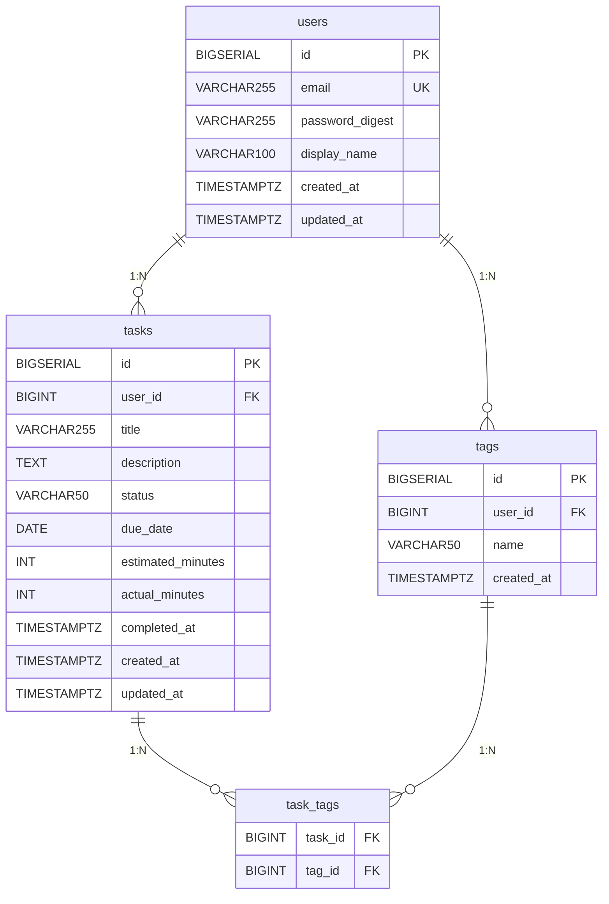

# ER図

## テーブル関連図

---

## リレーション説明

| リレーション | 種別 | 説明 |
|---|---|---|
| `users` → `tasks` | 1:N | 1ユーザーは複数タスクを持つ |
| `users` → `tags` | 1:N | 1ユーザーは複数タグを持つ |
| `tasks` ↔ `tags` | N:M | 中間テーブル `task_tags` で結合 |

---

## 参照先テーブル定義書

- [`docs/db/users.md`](./users.md)
- [`docs/db/tasks.md`](./tasks.md)
- [`docs/db/tags.md`](./tags.md)
